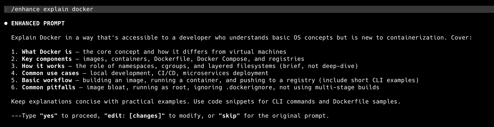

# 🔧 Prompt Enhancer Pack for Claude Code

Stop writing vague prompts. This pack auto-enhances your prompts before Claude responds.


## Demo



Type `/enhance explain docker` → get a structured, detailed prompt → approve → get a high-quality response.

## Install (30 seconds)

```bash
git clone https://github.com/SivaJyothiPamarthy/prompt-enhancer-pack.git
cd prompt-enhancer-pack
chmod +x install.sh
./install.sh
```

Then **restart Claude Code**.

## Commands

| Command | Best For | Example |
|---------|----------|---------|
| `/enhance` | Anything | `/enhance explain kubernetes` |
| `/enhance-code` | Coding tasks | `/enhance-code python web scraper` |
| `/enhance-writing` | Writing tasks | `/enhance-writing blog post about AI` |
| `/enhance-for` | Other AIs | `/enhance-for chatgpt explain docker` |

### `/enhance [prompt]` — General purpose

Takes any rough prompt and adds specificity, structure, and format preferences.

```
/enhance explain kubernetes
/enhance compare SQL vs NoSQL
/enhance help me with system design interview prep
```

### `/enhance-code [prompt]` — Code focused

Adds language, error handling, testing, edge cases, code style.

```
/enhance-code REST API with authentication
/enhance-code python web scraper
/enhance-code fix the memory leak in my app
```

### `/enhance-writing [prompt]` — Writing focused

Adds audience, tone, structure, length, key themes.

```
/enhance-writing cover letter for Google
/enhance-writing blog post about AI trends
/enhance-writing product launch announcement email
```

### `/enhance-for [platform] [prompt]` — Cross-platform

Rewrites your prompt optimized for a specific AI. Copy the result and paste it there.

Supported: `chatgpt` · `gemini` · `cursor` · `copilot` · `claude`

```
/enhance-for chatgpt explain microservices
/enhance-for cursor build a login component in React
/enhance-for gemini compare cloud providers
```

| Platform | Optimization Strategy |
|----------|----------------------|
| ChatGPT | Role-based framing, markdown, numbered steps |
| Gemini | Structured multi-part questions, explicit format requests |
| Cursor | File context, language/framework, function signatures |
| Copilot | Concise, code-focused, input/output types, edge cases |
| Claude | Clear constraints, step-by-step, well-defined scope |

## How It Works

1. Type a rough prompt after any `/enhance` command
2. Claude rewrites it into a structured, detailed version
3. Choose: **yes** (proceed) · **edit: [changes]** (modify) · **skip** (use original)
4. Claude responds only after your confirmation

## Project Structure

```
prompt-enhancer-pack/
├── README.md
├── install.sh
└── skills/
    ├── enhance/SKILL.md             → /enhance
    ├── enhance-code/SKILL.md        → /enhance-code
    ├── enhance-writing/SKILL.md     → /enhance-writing
    └── enhance-for/SKILL.md         → /enhance-for
```

## Uninstall

```bash
rm -rf ~/.claude/skills/enhance
rm -rf ~/.claude/skills/enhance-code
rm -rf ~/.claude/skills/enhance-writing
rm -rf ~/.claude/skills/enhance-for
```

## Contributing

PRs welcome! To add a new enhancer:

1. Create `skills/your-skill-name/SKILL.md`
2. Add YAML frontmatter with `name` and `description`
3. Write the enhancement instructions in markdown
4. Test it locally, then submit a PR

## Requirements

- Claude Code 2.x+

## License

MIT
